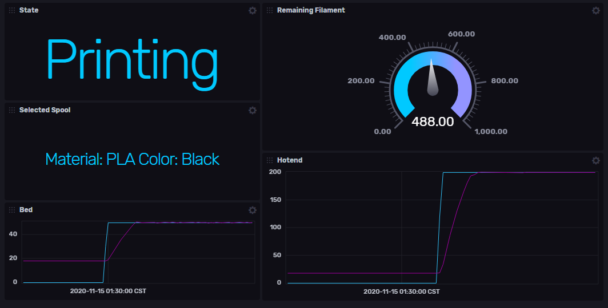

# OctoPrint Telegraf Plugin


Gather useful information from the octoprint API

## Configuration

Example plugin.conf required for plugin

```toml
[[inputs.octoprint]]
url="http://xxx.xxx.x.xxx:xxx/"
apikey=""
```

To integrate with telegraf, extend the telegraf.conf using the following example

```toml
[[inputs.execd]]
command = ["/path/to/octoprintbinary", "-config", "/path/to/plugin.conf"]
signal = "none"
```

## Development

Refer to [deploy.sh](deploy.sh) for a building and deploying example

Useful for debugging

```bash
journalctl -l -u telegraf.service -b -n 10
```

## Helpful resources

* [External plugin overview](https://github.com/influxdata/telegraf/blob/master/plugins/common/shim/README.md)
* [Examples of other external plugins](https://github.com/influxdata/telegraf/blob/master/EXTERNAL_PLUGINS.md)

## Example Dashboard

